.. _aws:

============================================
Prologue: Signing up for Amazon Web Services
============================================

This project will give you the tools to deploy your website to the
`Amazon Web Services (AWS) <http://aws.amazon.com/>`_ Cloud. For this to
happen, however, you need to have an account with AWS. The process is
very straightforward, and the actual signup is not detailed here.

Once you're done, you'll be greeted by the overwhelming AWS console.

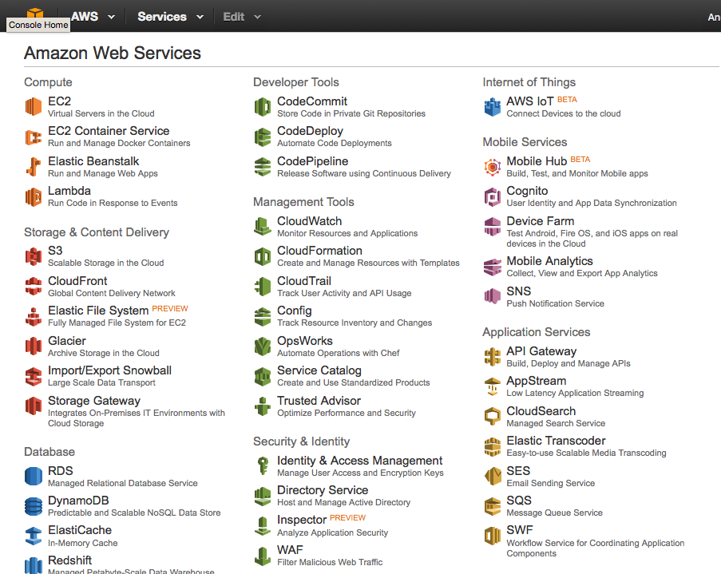

   AWS Console, accessible by clicking the top left icon.

Section Goals
=============

Once you have an account, your goal will be to create a user to allow
command-line access to the cloud. However, before we can create the
user, we will have to secure the cloud.

Both securing an account and creating a user happen in the Identity and
Access Management (IAM) section.  You can find it on the AWS console
under Security & Identity, or you can `click here
<https://console.aws.amazon.com/iam/home>`_ if you're currently logged
in.

Securing your Account
=====================

When you are greeted by the IAM Management Console, you will discover a
list of actions to take to secure your cloud resources.

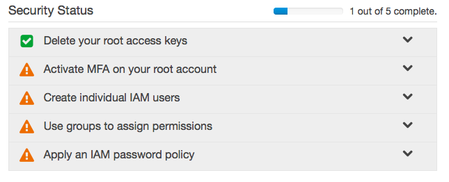

   Security Task List in the AWS IAM Management Console

By default on new accounts, the first item will have been completed for
you (if your account is older, this may not have been done for you).

The second item, `Multi-Factor Authentication (MFA)
<https://en.wikipedia.org/wiki/Multi-factor_authentication#Authentication_Factors>`_,
will allow us to setup `Two-Factor Authentication
<https://en.wikipedia.org/wiki/Two-factor_authentication>`_ using a
smartphone. This is certainly not required, but I heartily recommend it.
Click on the *Activate MFA on your root account* item in the list, then
on *Manage MFA*, and then follow the instructions. You will need to
install Google Authenticator on your smartphone to properly setup the
service.

You may have to hit the *Dashboard* link towards the top left of your
window to get back to the IAM console. You'll be greeted by a green
checkmark in your task list.

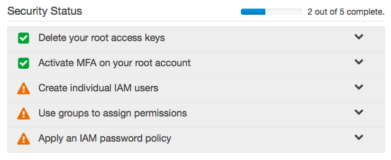

   Security Task List with MFA Setup Complete

We can then skip to the end of the task list, and setup password restrictions
for any future users. Click on *Apply an IAM password policy* and then on
*Manage Password Policy*. You'll be greeted with a page with a number of
choices. My usual selection consists of the following (but feel free to
pick your own):

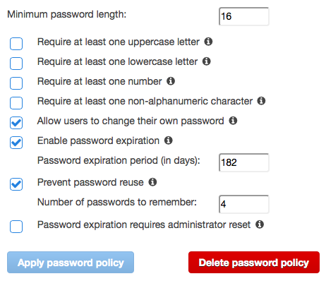

   Andrew's Password Policy Settings.

Once you successfully apply a password policy, the task list will appear
with three checkmarks:

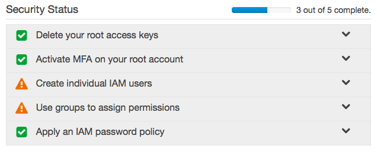

   Security Task List with Password Policy Complete

Creating a User and applying permissions with a Group
=====================================================

With user management comes the idea of permissions: we want to restrict
what a user can do on our system for security purposes. The best way to
do this is to create a group, and assign permissions to that group. We
then add users to that group, rather than adding permissions directly to
the user.

Creating a Group with Permissions
---------------------------------

Our first task is thus to create a group. In the IAM console, in our
security task list, click on *Use groups to assign permissions* and then
on *Manage Groups*.  Alternatively, you can simply click on *Groups* in the
sidebar on the left.

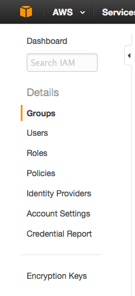

   Groups button in the IAM Console Sidebar

On this new page, click on the *Create New Group* button. This will
bring you to the Create New Group Wizard. I will call the new group
**administrators** and then click *Next Step* at the bottom right of the
screen. This brings us to the long list of permissions we can apply to
our new group.

.. figure:: images/group_attach_policy.png
   :alt: IAM Console Sidebar

   Groups button in the IAM Console Sidebar

As we're creating a user policy for our own command-line access, we want
to give ourselves full access to the cloud. We therefore click the
checkbox next to *AdministratorAccess*, and click *Next Step*.

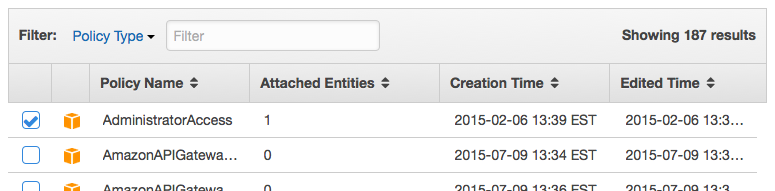

   AdministratorAccess Policy in the AWS IAM Create New Group Wizard

AWS will give us an overview of our new group, allowing us to click
*Create Group* to actually finish the task.

.. figure:: images/administratoraccesspolicy_review.png
   :alt: AdministratorAccess Policy Review

   AdministratorAccess Policy Review in the AWS IAM Create New Group Wizard

Creating a User
---------------

Finally, we can create a user, and then add the user to our
**administrators** group.

Much like with groups, we can either click on *Create individual IAM
users* in the task list and then click on *Manage Users*, or use the
*Users* link in the sidebar. On the new page, click *Create New Users*.

We only need a single user, so I will only fill in the top text field.
Make sure that *Generate an access key for each user* checkbox at the
bottom of the textfields is checked (the default).

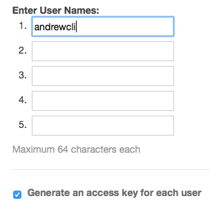

   Create User in AWS IAM Console

With this new user created, you will be prompted to download the
authentication credentials for the new user (the button at the bottom
right of the screen on the new page). You will need this information
when generating the static site project with our template. I recommend
saving this information in a safe location, such as a password manager,
as this information gives full access to your AWS account.

After you've downloaded and saved your credentials, your new user will
appear in the list of users.

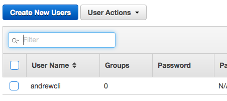

   New User in User List of AWS IAM Console

If you click on the new user, the full profile will be displayed.

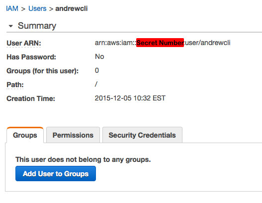

   New User Profile

.. Warning::
   The Amazon Resource Numbers (ARNs) associated with various cloud
   resources are unique, and should be kept semi-secret.

Use the *Add User to Group* button to add the new user to the
**administrators** group.

Having created a user and assigned it a group with permissions, the task
list for securing your account is now complete. Congratulations!

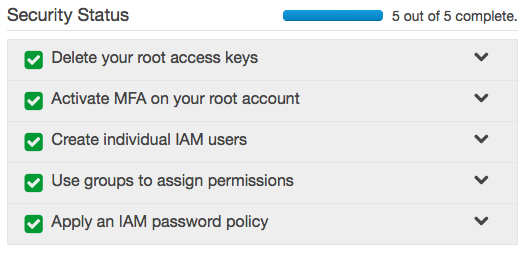
